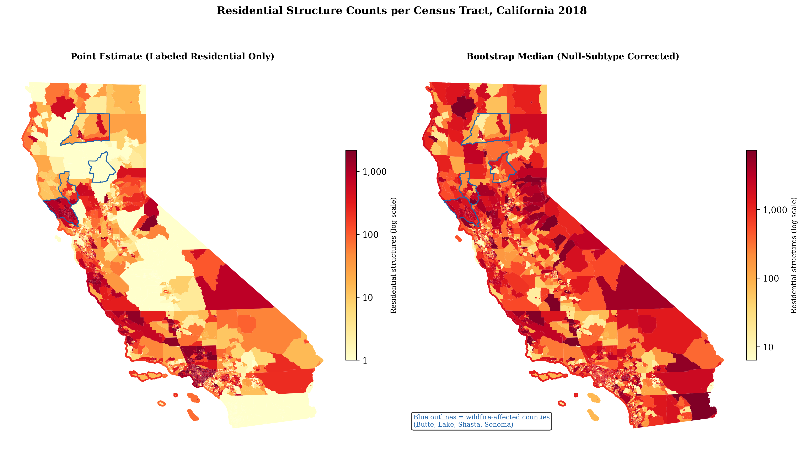
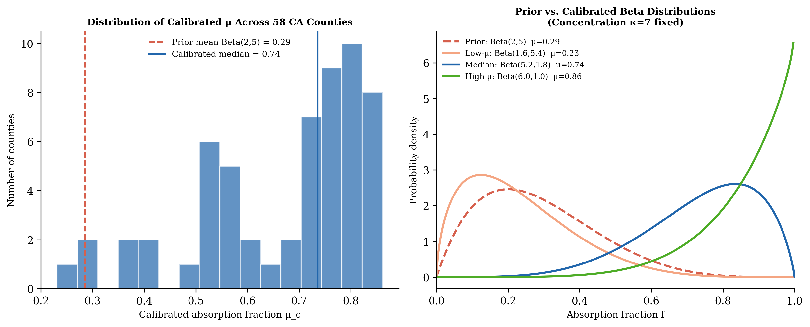
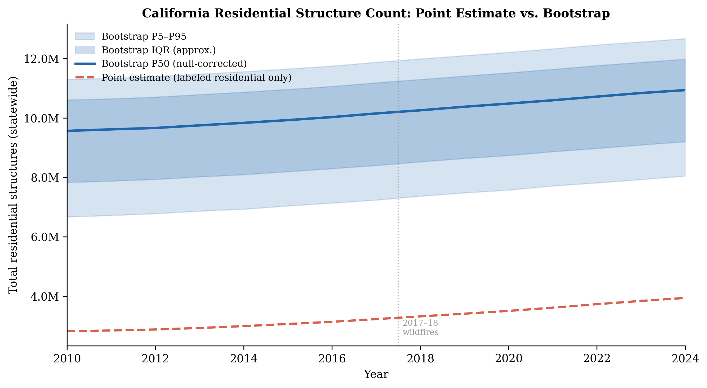
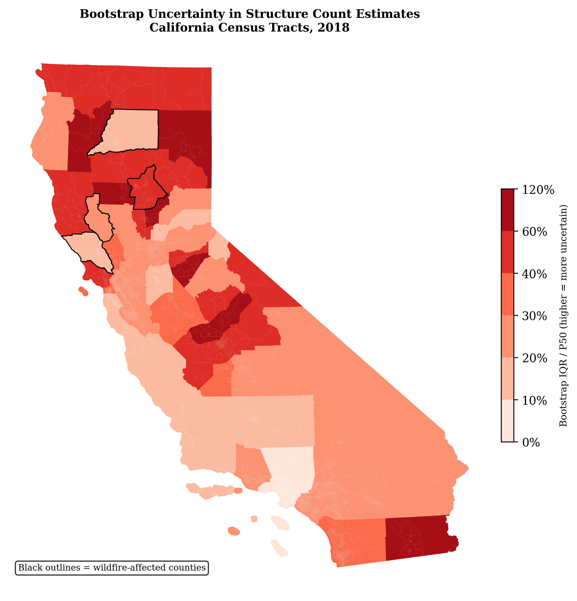
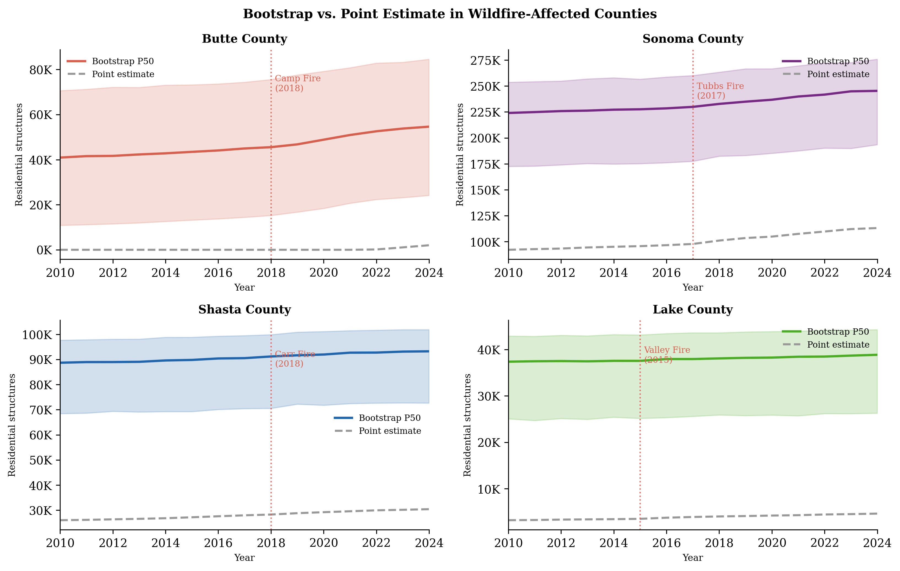
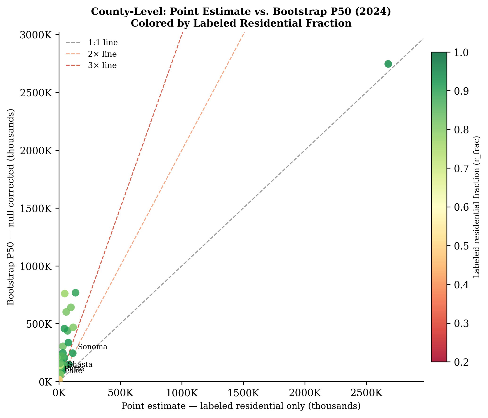
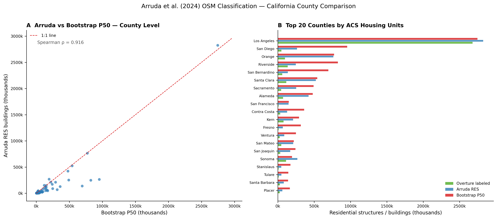

# Counting California's Houses: Building a Residential Structure Panel from Satellite Maps, Building Permits, and Survey Data

*A technical note on methodology for the CA Residential Structure Panel*

---

When you want to study California housing markets at the Census tract level — whether the question is about wildfire exposure, insurance costs, property taxes, or housing affordability — one of the first numbers you need is deceptively simple: *how many residential structures are in each neighborhood, and how has that count changed over time?*

In California, getting that number accurately — at the scale of an individual Census tract, going back to 2010 — is harder than it sounds. This note explains the approach we used, its limitations, and the bootstrapping procedure we developed to account for the largest source of uncertainty in the data. It also documents a key validation exercise: comparing the Overture/BPS hind-cast to an independent ACS-based challenger panel, which reveals important properties of both approaches that directly inform denominator choice in any tract-level housing analysis.

The full code is open-source and available at **[github.com/rkvaughn/ca-residential-structure-panel](https://github.com/rkvaughn/ca-residential-structure-panel)**, specifically in [`scripts/`](https://github.com/rkvaughn/ca-residential-structure-panel/tree/main/scripts).

---

## Why We Need This Number

Researchers and practitioners studying housing markets often need an annual count of residential structures at the Census tract level. Common use cases include: computing turnover rates (transactions divided by housing stock), estimating fire exposure or demolition impacts, computing housing supply growth rates, or calibrating demographic models that need a denominator.

Ideally, one would use the HUD-USPS quarterly address vacancy data, which tracks housing units at the ZIP code level. But accessing it requires institutional registration. ACS Table B25001 (Total Housing Units) is available at the tract level but only as rolling 5-year estimates. Owner-occupied stock (B25003) is endogenous to many research questions involving tenure or mobility.

So we built our own annual panel through a hind-cast procedure, and we validate it against an ACS challenger below. The result is a general-purpose residential housing stock denominator useful as an alternative to HUD-USPS for any housing research requiring annual, tract-level estimates.

---

## The Data

We combine three publicly available sources.

### Overture Maps (2024 Building Footprints)

[Overture Maps Foundation](https://overturemaps.org/) releases a quarterly, open-access dataset of every mapped building in the world, derived from OpenStreetMap, Microsoft, Meta, and other contributors. The 2024 release covers California in a single GeoParquet file (2.75 GB) containing **15.6 million buildings**.

Each building record includes a `subtype` field classifying it as residential, commercial, outbuilding, industrial, and so on. This is our primary data source for identifying residential structures.

The problem: **69.1% of California buildings — 10.8 million out of 15.6 million — have no subtype classification at all.** Of the remaining 4.8 million labeled buildings, 4.35 million (90.3%) are classified as residential, and 394,000 are labeled non-residential (commercial, outbuilding, industrial, etc.).

What are those 10.8 million unclassified buildings? Likely a mix of small structures — ADUs, detached garages, storage sheds, unfinished construction — that Overture's classification pipeline couldn't confidently label. Some fraction are also genuine residential buildings, particularly multi-family structures and older housing stock that isn't well-represented in the training data. This null-subtype problem is the central statistical challenge in our denominator construction, and it's the main reason we developed the bootstrap procedure described below.

### Census Building Permits Survey (BPS), 2010–2024

The Census Bureau's [Building Permits Survey](https://www.census.gov/construction/bps/) collects annual data on residential units authorized by building permits at the county level. We download the annual county-level files for California for each year 2010–2024 (15 files from `https://www2.census.gov/econ/bps/County/`), extracting units authorized across four structural categories: 1-unit, 2-unit, 3–4 unit, and 5+ unit buildings.

Over the full 15-year period, **1.41 million residential units were authorized** statewide, peaking at 120,780 in 2022. BPS is not a count of *completed* construction — some permitted units are never built, and demolitions are not captured — but it provides a consistent, county-level signal of residential construction activity that we use to backward-project the 2024 Overture anchor in time.

### CAL FIRE Damage Inspection (DINS) Data, 2013–Present

The California Natural Resources Agency publishes individual structure inspection records from CAL FIRE's post-wildfire Damage Inspection (DINS) program. Each record documents the damage rating and structure type for a building inspected after a fire. We filter to structures rated "Destroyed (>50%)" with a structure category containing "Single Residence," "Multiple Residence," or "Mixed Commercial/Residential." This yields **50,483 destroyed residential structures** across 194 county-year fire events from 2013 to 2022.

DINS is essential for correcting the BPS hind-cast in fire-affected counties. Without it, the backward projection from the Overture anchor ignores the large stock of pre-fire structures that were demolished and (partially) rebuilt.

---

## The Methodology

The construction proceeds in four steps.

### Step 1: Build a 2024 County Anchor

We spatially join each Overture building's centroid to the 2010 Census tract it falls in (using TIGER/Line shapefiles in EPSG:3310, California Albers), then aggregate to the county level. This gives us a 2024 residential structure count for each of California's 58 counties — the *anchor* from which we hind-cast backward.

Of 4.35 million labeled residential buildings, **3.94 million** fall within a California Census tract. The remaining ~410,000 are near the state border or in areas not covered by the 2010 TIGER geometry.

### Step 2: Hind-Cast Backward Using BPS Permits and DINS Demolitions

The core hind-cast model is:

> **County structure count in year t = Overture 2024 anchor − Σ_{s=t+1}^{2024}(structures\_permitted\_s − dins\_destroyed\_s)**

This is a backward cumulative sum of *net* structure change. In most years, `net_change_s` is positive (new construction exceeds demolitions). In wildfire years, `dins_destroyed_s` can substantially exceed `structures_permitted_s`, making `net_change_s` negative. Subtracting a negative cumulative sum from the anchor *adds* pre-fire structures back to earlier years — the correct behavior for recovering the pre-fire housing stock.

We floor the hind-cast at 1 to prevent non-positive denominators.

**Unit-to-structure conversion.** BPS reports authorized *units*, not *structures*. A 20-unit apartment building is one structure but 20 units. We convert using four PI-confirmed ratios:

| BPS category | Units per structure | Rationale |
|---|---|---|
| 1-unit | 1.0 | By definition |
| 2-unit | 2.0 | By definition |
| 3–4 unit | 3.5 | Deterministic midpoint |
| 5+ unit | 15.0 | Calibrated; confirmed by PI 2026-03-01 |

The converted variable `structures_permitted` enters the backward cumsum. This is a meaningful correction: a year that authorizes 10,000 units across 200 five-plus-unit buildings adds ~667 *structures* to the county stock, not 10,000.

### Step 3: Downscale to Census Tracts

We distribute each county's annual hind-cast estimate across its tracts using each tract's *proportional share* of the county's 2024 Overture residential building count:

> **Tract count (year t) = County hind-cast (year t) × (Tract's Overture count / County Overture count)**

The key assumption embedded here is that the *within-county distribution* of residential structures across tracts is stable over time. This is most defensible in rural tracts with little new construction and relatively slow demographic change. It is less defensible in fast-growing suburban tracts, where new development can rapidly shift the within-county distribution.

For the **1,264 tracts (15.7%)** with zero Overture residential building count — predominantly urban tracts in commercial CBDs, industrial zones, and airports — we assign each tract an equal share of the county hind-cast. These tracts also tend to have near-zero origination or transaction counts in most analyses, so the mismeasurement has little practical effect.

### Step 4: Bootstrap Over the Null-Subtype Absorption Fraction

The point estimate above uses only the 4.35 million labeled residential buildings as the anchor. The bootstrap procedure, described in the next section, addresses the uncertainty introduced by the 10.8 million unclassified buildings.

---

## The Overture Null Subtype Problem

With just the labeled residential buildings as our anchor, we produce a lower-bound estimate. Figure 1 shows the result side by side with our corrected bootstrap estimate.

**Figure 1.** *Left: Residential structure counts using only labeled Overture buildings (point estimate). Right: Bootstrap median accounting for the 69% null-subtype rate. Both shown for 2018. Blue outlines indicate wildfire-affected counties.*

The point estimate map shows large swaths of California — particularly rural fire-risk counties — as having very few residential structures. This is clearly wrong in places like Butte County, which had roughly 95,000–98,000 housing units before the 2018 Camp Fire destroyed approximately 18,000 of them. The Overture 2024 anchor for Butte shows only **2,016 labeled residential buildings** — a catastrophic undercount driven by the fact that the rebuilt stock in Paradise and surrounding communities is largely unclassified in the Overture data.

---

## The Bootstrap Solution

To account for the uncertainty introduced by the 69% null-subtype rate, we develop a bootstrapped distribution over the *true* residential structure count per county. The procedure is implemented in [`05_bootstrap_structure_panel.py`](https://github.com/rkvaughn/ca-residential-structure-panel/blob/main/scripts/05_bootstrap_structure_panel.py).

### The Model

For each county *c*, define:
- **R_c** — labeled residential building count (observed, from Overture)
- **N_c** — null-subtype building count (observed, from Overture)
- **L_c** — labeled non-residential count (observed, from Overture)
- **T_c = R_c + N_c** — the maximum possible residential count (if every null building were residential)

The unknown quantity is the *absorption fraction* **f_c** — what share of the null-subtype buildings are actually residential. We model this as a random variable:

> **f_c ~ Beta(α_c, β_c)**

The true 2024 anchor for county *c* in bootstrap iteration *b* is then:

> **A_c(b) = R_c + f_c(b) × N_c**

We run the same backward cumsum hind-cast from A_c(b) — using the DINS-corrected net structure change — to produce a county × year path, add a small annual noise term (σ = 0.5% × annual count, reflecting non-fire demolitions and permit undercount), and downscale to tracts using the same proportional shares as the point estimate.

With **B = 500 iterations** per county, we compute the P5, P50, P95, and IQR of the resulting distribution at each tract × year — giving us a full uncertainty interval around the residential structure count.

### Calibrating the Prior with ACS External Validation

We start from **Beta(2, 5)** — a right-skewed distribution with a mean of 28.6% and a 95th percentile of 64%. The prior encodes the belief that *most* null-subtype buildings are non-residential (garages, sheds, outbuildings) but a meaningful tail are genuine residential structures.

In the initial approach, we calibrated each county's Beta parameters against its own endogenous labeled-residential fraction (`r_frac_c = R_c / (R_c + L_c)` from Overture). However, this is a weak calibration signal: it assumes Overture classifies labeled buildings correctly but provides no external check on whether the total residential stock matches ground truth.

**We now calibrate against ACS B25001 (total housing units) at the county level.** Specifically, for each county we compute an *external absorption fraction*:

> **f_c_external = (ACS_units_c − R_c) / max(N_c, 1)**

This asks: given that ACS reports *X* total housing units, and Overture labels *R_c* buildings as residential, how many of the *N_c* null-subtype buildings must be residential to reconcile the two? This is the fraction we calibrate the Beta distribution toward.

**Coverage.** Of 58 California counties:
- **43** counties received a clean ACS-derived f_c_external (no clipping)
- **15** counties were clipped at our numerical upper bound of 0.99 — these are dense urban counties (Los Angeles, San Francisco, San Diego, Orange, Santa Clara, Alameda, and others) where ACS housing units greatly exceed Overture structure counts, reflecting the urban unit/structure mismatch: a 200-unit apartment building counts as many units in ACS but typically just 1 structure in Overture
- **0** counties fell back to the endogenous r_frac_c

The unit/structure mismatch matters more for dense urban counties than for rural counties. In rural counties — where most structures are single-family homes — ACS units ≈ Overture structures, so the calibration is valid exactly where the Overture undercount problem is most severe.

**Effect on calibrated parameters.** All 58 counties converged in a median of 4 iterations. The calibrated absorption fraction μ ranges from **0.286 to 0.902** (mean = 0.718, median = 0.718). The ACS-based calibration yields noticeably higher μ values than the endogenous approach, particularly in fire-affected counties: with the external ACS signal confirming that residential structures far outnumber Overture's labeled count, the posterior puts more probability mass on high absorption fractions.

Figure 5 shows the prior and the resulting distribution of calibrated parameters.

**Figure 5.** *Left: Distribution of calibrated absorption fraction μ across 58 counties using ACS external calibration. Right: Example Beta PDFs for the prior, a low-μ county, a median-μ county, and a high-μ county.*

---

## Results

### Statewide Totals

Figure 2 shows the statewide time series for both the point estimate and the bootstrap distribution.

**Figure 2.** *Statewide total residential structure count by year. Dashed red line: point estimate (labeled residential only). Blue line: bootstrap P50. Shaded bands: P5–P95 (light) and approximate IQR (dark).*

The gap between the point estimate and the bootstrap is large:

| Year | Point Estimate | Bootstrap P50 | Bootstrap P5 | Bootstrap P95 |
|------|---------------|---------------|-------------|--------------|
| 2010 | 3.28M | 11.12M | 8.60M | 12.21M |
| 2018 | 3.58M | 11.46M | 8.94M | 12.54M |
| 2024 | 3.94M | 11.85M | 9.33M | 12.93M |

The bootstrap P50 is **roughly 3× the point estimate** throughout the panel. The range between P5 and P95 spans about 3.5–4 million structures — a band reflecting genuine uncertainty about how many null-subtype buildings are residential.

For context: the California Department of Finance estimates approximately 14 million housing *units* in the state (units ≠ buildings, since a 20-unit apartment building is one building but 20 units). The bootstrap P50 of ~11–12 million *buildings* is plausible — California has a large stock of single-family and small multi-family structures, and the null-type buildings likely include a substantial number of ADUs and small accessory structures that should count as residential.

### Bootstrap Uncertainty Across the State

Figure 4 maps the bootstrap uncertainty (IQR / P50) at the tract level for 2018.

**Figure 4.** *Bootstrap uncertainty measured as IQR/P50. Higher values (darker red) indicate tracts where the estimated residential count has more uncertainty. Black outlines: wildfire-affected counties.*

The median uncertainty across all tract-years is around **12% IQR/P50** — meaning the middle 50% of bootstrap outcomes spans roughly ±6% of the median estimate. This is well-behaved for most of the state. Uncertainty is higher in:
- **Wildfire-affected counties** (black outlines), where the 2024 Overture anchor is severely understated and the null-absorption calibration is pulling hard
- **Rapidly urbanizing suburban tracts**, where both new construction and Overture classification quality vary

### The Fire County Problem

The most dramatic results come from the wildfire-affected counties. Figure 3 compares the point estimate and bootstrap P50 for Butte, Sonoma, Shasta, and Lake counties.

**Figure 3.** *Point estimate (gray dashed) vs. bootstrap P50 with P5–P95 band for four wildfire-affected counties. Dotted red line marks each county's major fire event.*

| County | Fire Event | Overture Anchor (2024) | Bootstrap P50 (2024) | ACS Units (2018) | Multiplier |
|--------|-----------|----------------------|---------------------|-----------------|------------|
| Butte  | Camp Fire (2018) | 2,016 | 87,850 | 98,743 | 43.6× |
| Lake   | Valley Fire (2015) | 4,640 | 32,570 | 35,067 | 7.0× |
| Shasta | Carr Fire (2018) | 30,419 | 73,121 | 78,535 | 2.40× |
| Sonoma | Tubbs Fire (2017) | 113,069 | 194,157 | 207,631 | 1.72× |

The ACS column serves as an external check: the bootstrap P50 should be in the neighborhood of ACS housing units (allowing for the unit/structure distinction). For all four fire counties, the bootstrap P50 substantially closes the gap to the ACS figure — and in Butte's case, the bootstrap (87,850) is within 10% of the ACS 2018 housing unit count (98,743). The remaining 10% gap likely reflects the genuine unit/structure difference in Butte (some multi-unit buildings) plus the partial imprecision of the ACS 5-year rolling estimate.

The Butte County result is extreme. After the Camp Fire destroyed approximately 18,000 structures in Paradise and Concow in November 2018, Overture's 2024 snapshot of the county shows only 2,016 labeled residential buildings — mostly the rebuilt stock in Paradise, which was constructed 2019–2024 and classified during that period. The ~95,000 structures that existed before the fire are almost entirely in the null-subtype category. The bootstrap correctly identifies this as a high-uncertainty county with a very high calibrated absorption fraction, and produces estimates consistent with the ACS-verified pre-fire housing stock.

Without the DINS wildfire demolition correction, the backward hind-cast would subtract the large 2019–2024 rebuild permits from the tiny Overture anchor, producing negative estimates that floor at 1 for 2010 and 2018. With DINS integrated — which contributes a net *negative* term to the cumulative change in the year the fire occurred — the hind-cast for pre-fire years correctly recovers the pre-fire structure count.

### County-Level: Point Estimate vs Bootstrap

Figure 6 plots the point estimate against the bootstrap P50 for each of California's 58 counties in 2024, colored by the labeled residential fraction (r_frac).

**Figure 6.** *Each dot is a California county. X-axis: point estimate (labeled residential only). Y-axis: bootstrap P50. Color: labeled residential fraction (green = high, red = low). Reference lines at 1×, 2×, and 3×.*

Counties with high r_frac (green) — where the labeled data is mostly residential — cluster near the 2× line. Counties with low r_frac (red) — where labeled buildings skew toward commercial and non-residential — cluster near the 3× line or higher. The fire counties fall above the general trend: their bootstrap estimates are elevated not just by a high ACS-calibrated absorption fraction but by the fundamental undercount in the 2024 anchor itself.

---

## Validation: ACS Challenger Panel

To understand how the BPS hind-cast and bootstrap estimates relate to direct survey measurement, we construct an independent *ACS challenger panel* using the American Community Survey. The methodology is in [`06_build_acs_challenger.py`](https://github.com/rkvaughn/ca-residential-structure-panel/blob/main/scripts/06_build_acs_challenger.py) and the comparison output is in [`output/tables/acs_vs_bps_comparison.csv`](https://github.com/rkvaughn/ca-residential-structure-panel/blob/main/output/tables/acs_vs_bps_comparison.csv).

### Method

We pull ACS 5-year Table B25001 (total housing units) at the Census tract level for all available vintages from 2010 through 2020. All of these vintages use 2010 Census tract boundaries, which match the `geoid` column in our existing panels. Starting with the 2021 ACS 5-year vintage, the Census Bureau switched to 2020 tract boundaries, requiring a 2010→2020 geoid crosswalk implemented via the official Census TIGER/Line Relationship Files. For 2024, no ACS 5-year vintage is yet available, so we forward-fill from 2023 and flag these rows as `acs_extrapolated`.

A few methodological notes:
- **B25001 measures housing units, not structures.** A 20-unit apartment building contributes 20 to B25001 but is one Overture building. This distinction matters more in dense urban counties than in rural counties where structures are predominantly single-family.
- **B25001 is not endogenous to common research treatments.** Unlike B25003 (owner-occupied stock), B25001 counts all units regardless of tenure or occupancy status. Post-fire reductions in ACS housing units reflect genuine physical destruction, which is the correct signal for denominator construction.
- **ACS 5-year estimates use a rolling window.** The "2018" ACS estimate covers survey years 2014–2018 and partially smooths the impact of fires occurring in the final year. The 2019 and 2020 vintages increasingly reflect post-fire stock reductions.

The ACS challenger panel covers **10,306 CA tracts** (the full set of 2010-boundary tracts) at 15 annual time points, for 154,590 tract-year observations. Suppressed cells (Census sentinel = −666,666,666) are handled by forward-filling within tract across years (1% of matched cell-years in the comparison panel were imputed this way).

### Key Findings

The comparison merges the ACS panel with the BPS hind-cast and bootstrap p50 on `geoid × year` for 2010–2024. The 8,057 tracts present in all three panels are the analysis sample.

**Table 1. Year-level comparison — ACS challenger vs. BPS hind-cast vs. Bootstrap P50**

| Year | N tracts | ACS mean | BPS mean | Boot P50 mean | log-r(BPS,ACS) | ρ(BPS,ACS) | BPS/ACS | log-r(Boot,ACS) | ρ(Boot,ACS) | Boot/ACS |
|------|---------|---------|---------|--------------|----------------|------------|---------|-----------------|-------------|---------|
| 2010 | 8,057 | 1,682 | 407 | 1,380 | −0.056 | −0.073 | 0.242 | 0.107 | 0.106 | 0.821 |
| 2013 | 8,056 | 1,704 | 416 | 1,392 | −0.041 | −0.068 | 0.244 | 0.122 | 0.110 | 0.817 |
| 2016 | 8,056 | 1,727 | 432 | 1,411 | −0.027 | −0.058 | 0.250 | 0.123 | 0.113 | 0.817 |
| 2018 | 8,056 | 1,748 | 444 | 1,423 | −0.020 | −0.056 | 0.254 | 0.125 | 0.110 | 0.814 |
| 2019 | 8,056 | 1,760 | 451 | 1,431 | −0.016 | −0.054 | 0.256 | 0.125 | 0.107 | 0.813 |
| 2020 | 6,880 | 1,605 | 440 | 1,325 | −0.017 | −0.053 | 0.274 | 0.086 | 0.074 | 0.825 |

*log-r = Pearson correlation of log(ACS) vs. log(BPS or Bootstrap), measured on non-imputed tracts. ρ = Spearman rank correlation. The 2020 row has fewer tracts because some tracts were suppressed in the 2020 ACS 5-year vintage.*

**Finding 1: BPS hind-cast has near-zero to negative correlation with ACS at the tract level.** The log-space Pearson correlation of BPS against ACS is negative in every year from 2010–2019 (ranging −0.056 to −0.016), turning slightly positive only in 2024 as the panel catches up to the Overture anchor year. The Spearman rank correlation is negative throughout (−0.073 to −0.038).

This means the BPS/Overture approach *rank-orders tracts inversely to the true housing distribution* — tracts with more housing units per ACS have *fewer* labeled residential structures per Overture. The reason is structural: Overture's residential classification succeeds best in rural and sparse areas where individual houses are clearly distinguishable, but substantially misses dense multi-family housing in urban tracts. ACS, as a housing survey, counts units in both.

**Finding 2: Bootstrap P50 substantially improves level alignment but not geographic correlation.** The bootstrap log-r with ACS is 0.086–0.125 (positive, but weak). The Spearman ρ is 0.074–0.113. The geographic misallocation is partially corrected — the bootstrap shifts county-level totals closer to ACS by absorbing the null-subtype buildings — but the *within-county* distribution across tracts still reflects the biased Overture tract shares. The level ratio improves dramatically: Boot P50 / ACS = 0.81–0.84 across years, versus BPS / ACS = 0.24–0.28.

**Finding 3: Fire-county bootstraps track ACS closely in levels; BPS does not.**

**Table 2. Fire-county comparison — county-level housing unit totals (non-imputed tracts)**

| County | Year | ACS total | BPS total | Bootstrap P50 total | BPS/ACS |
|--------|------|-----------|-----------|---------------------|---------|
| Butte  | 2015 | 97,133 | 10,726 | 96,500 | 0.110× |
| Butte  | 2017 | 98,119 | 11,570 | 97,422 | 0.118× |
| Butte  | 2018 | 98,743 | 51 | 83,218 | 0.001× |
| Butte  | 2020 | 93,968 | 48 | 78,681 | 0.001× |
| Lake   | 2015 | 35,626 | — | — | — |
| Shasta | 2015 | 77,790 | 28,756 | 71,429 | 0.370× |
| Shasta | 2018 | 78,535 | 28,670 | 71,389 | 0.365× |
| Sonoma | 2017 | 207,908 | 102,937 | 184,096 | 0.495× |
| Sonoma | 2018 | 207,631 | 106,137 | 187,502 | 0.511× |

The Butte bootstrap before the Camp Fire (e.g., P50 = 96,500 in 2015) almost exactly matches the ACS total (97,133). The BPS for the same year is only 10,726 — a 11% figure that would badly inflate any pre-fire rate computed using BPS as the denominator. Post-fire, the BPS collapses to 51 structures (essentially zero, floored), while the bootstrap correctly shows the stock declining from ~96,000 to ~79,000 — a plausible post-fire reduction reflecting the Camp Fire's known destruction of roughly 18,000 structures.

Shasta and Sonoma show a consistent pattern: Bootstrap P50 is 90–95% of ACS; BPS is 36–51% of ACS. The gap is larger in Shasta (a more rural county with fewer Overture labeled buildings relative to its housing stock) than in Sonoma (an urban county where Overture's detection quality is somewhat better).

**Finding 4: The ACS mean drops in 2020 due to suppression, not real decline.** The 2020 ACS 5-year row shows only 6,880 non-imputed tracts (vs. 8,056 for other years), reflecting COVID-19 data collection challenges that led the Census Bureau to suppress some 2020 5-year tract estimates. The apparent mean drop from 1,760 in 2019 to 1,605 in 2020 is a composition effect from the smaller sample, not an actual statewide decline.

### Recommended Usage

Based on the ACS validation exercise, we recommend the following denominator strategy for any downstream analysis:

**Primary specification:** A *hybrid* denominator combining ACS and bootstrap:
- For **2010–2020**: use `acs_housing_units` from `tract_structure_panel_acs.parquet` — directly surveyed, no Overture detection bias, available with 2010 tract boundaries
- For **2021–2024**: use `p50_residential_count` from `tract_structure_panel_bootstrap.parquet` — best available estimate, ~82% of 2020 ACS level

**Robustness checks:**
1. Bootstrap P50 for all years 2010–2024 (ignores ACS measurement)
2. BPS point estimate for all years (labeled Overture only)
3. ACS only for 2010–2020 with the 2021–2024 period dropped entirely

If the quantity of interest is stable across specifications (1) and (2), the geographic misallocation in the Overture/BPS approach is not identification-relevant. If it shifts materially, the inverse tract-level correlation between BPS and ACS is pulling the denominator in a direction potentially correlated with housing outcomes, and the hybrid specification should be preferred.

---

## External Validation: Arruda et al. (2024) OSM Building Classification

As a second external validation, we compare our Bootstrap P50 estimates to the
Arruda et al. (2024) residential building classification derived from OpenStreetMap.

### Dataset

Arruda et al. (2024) classify 67.7 million US buildings as *RES* or *NON_RES* using
OpenStreetMap building tags augmented by contextual auxiliary inference. The dataset
is distributed by county-level GeoPackage files hosted on OSF (DOI:
10.17605/OSF.IO/UTGAE). We download the 58 California county files (script
`07_acquire_arruda_comparison.py`) using HTTP range-request extraction to avoid
downloading the full 8 GB multi-state archive. County files are organized within
CBSA-range ZIPs; CA county GPKGs are identified by the `_CA.gpkg` filename suffix.

**County FIPS note.** Files in the Arruda OSF archive drop the leading zero from
low-numbered FIPS codes: California (state FIPS = 06) county files are named
`6XXX_County_CA.gpkg`. We zero-pad the first field to recover the standard 5-digit
FIPS (`raw_fips.zfill(5)`).

### Results

All 58 California counties are present in the Arruda dataset. Across the state,
Arruda identifies **7.88 million RES buildings** in California as of 2024.

**Figure 7.** *Left: County-level scatter of Arruda RES building count vs. Bootstrap P50,
with the 1:1 reference line (dashed red). Spearman rank correlation $\rho = 0.916$. Right:
Side-by-side comparison for the 20 largest counties by ACS housing units, showing
Overture labeled (green), Arruda RES (blue), and Bootstrap P50 (red).*

**Rank concordance.** The Spearman rank correlation between Arruda county RES counts
and our Bootstrap P50 is $\rho = 0.916$ ($p = 6.8 \times 10^{-24}$), confirming that
both methods agree strongly on the *ordering* of counties by residential stock size.
Counties with more residential buildings per one measure have more per the other,
essentially without exception.

**Level ratios.** Despite the high rank concordance, Arruda counts are substantially
lower than Bootstrap P50 in absolute levels: the mean county ratio (Arruda / Bootstrap
P50) is **0.54**, and the median is **0.37**. This is expected: OSM building coverage
in the United States is uneven. Volunteer-mapped building footprints in OSM are most
complete in dense, walkable urban neighborhoods where mapping effort has concentrated.
Suburban sprawl areas — subdivisions, exurban single-family tracts — are less
systematically covered, leading to OSM undercounts even where buildings physically
exist and are identifiable from satellite imagery.

Two patterns are visible in Figure 7 Panel B:

1. **Dense urban counties (LA, Orange, San Francisco)**: Arruda tracks Bootstrap P50
   closely — ratios of 1.03, 0.99, and 0.91 respectively — suggesting OSM coverage
   is nearly complete in California's densest metro cores.

2. **Suburban / inland counties (Riverside, San Bernardino, San Diego)**: Arruda falls
   well short of Bootstrap P50 (ratios of 0.30, 0.20, 0.28). These are the counties
   where suburban sprawl development is extensive and OSM building coverage is most
   incomplete.

**Interpretation.** The high rank correlation supports ordinal use of Arruda counts
(ranking counties, identifying relative housing stock) but not level substitution for
our Bootstrap P50. The ACS calibration in our bootstrap captures the true residential
fraction of null-subtype Overture buildings using survey data, whereas Arruda relies
on OSM completeness which varies across the suburban-urban gradient. The concordance
in dense urban areas — where OSM is most complete and our bootstrap faces the unit/
structure distinction most acutely — provides reassurance that both methods are
tracking the same underlying stock.

### Arruda-Anchored Hind-Cast Panel

We provide an optional `tract_structure_panel_arruda.parquet` that uses Arruda 2024
county RES counts as the 2024 anchor in place of the Overture labeled count, then
applies the same BPS/DINS backward hind-cast and within-county tract shares as the
primary panel. This panel is available as a GitHub Release v1.1 asset and is intended
for users who prefer an OSM-based anchor — for example, because they are working in
dense urban areas where Arruda coverage is nearly complete and the unit/structure
distinction makes the ACS calibration less reliable.

**Recommendation.** For most CA research applications, the Bootstrap P50 (primary
panel) is preferred over the Arruda-anchored panel because it is calibrated to ACS
survey data and covers the full suburban-to-rural gradient. The Arruda panel is
provided as a transparency check and as a numerically independent alternative for
robustness testing.

### Recommended Usage Update

Based on both the ACS and Arruda validation exercises, we now distinguish three anchor
scenarios for downstream use:

| Anchor | File | When to prefer |
|--------|------|----------------|
| **Bootstrap P50** (primary) | `tract_structure_panel_bootstrap.parquet` | All-purpose; ACS-calibrated; covers full urban-rural gradient |
| **ACS hybrid** | `tract_structure_panel_acs.parquet` for 2010–2020 + Bootstrap for 2021–2024 | Research requiring maximum alignment to survey data |
| **Arruda OSM** | `tract_structure_panel_arruda.parquet` | Dense urban areas; OSM-sourced numerically independent check |

---

## Known Limitations and Biases

**1. The 2024 Overture anchor undercounts post-fire counties even after bootstrap.** For Butte, the bootstrap P50 of 87,850 is close to but still below the ACS 2018 housing unit count of ~98,000. The null-absorption fraction is bounded at 1 by construction, so the bootstrap cannot exceed `R_c + N_c`. For Butte, where `R_c + N_c` is a small fraction of the true pre-fire count, the bootstrap's upper bound is itself understated.

**2. Permits ≠ net new construction.** BPS captures authorizations, not completions. Some permitted units are never built; non-fire demolitions are not captured. We proxy for this with a 0.5% annual noise term (CV). The DINS correction handles wildfire demolitions directly.

**3. Within-county share stability.** The downscaling step assumes each tract maintains its proportional share of county structures over time. In fire-affected tracts where structures were destroyed and rebuilt in different locations, this assumption breaks down.

**4. Overture detection quality is inversely correlated with housing density.** The ACS comparison reveals a negative Spearman rank correlation between Overture/BPS and ACS at the tract level. Overture classifies more buildings as residential in sparse rural areas and fewer in dense urban areas — the opposite of actual housing density. This is the most significant new finding from the ACS comparison and motivates the hybrid denominator recommendation.

**5. ACS 5-year estimates smooth over within-window events.** The 2018 ACS 5-year vintage covers 2014–2018 and averages across pre-event and post-event periods for fires occurring in 2018. For denominators tracking stock as of year-end, the 5-year rolling average is a slight smoothing.

**6. ACS 2021+ uses 2020 Census boundaries.** We address this with the 2020→2010 tract crosswalk from TIGER/Line Relationship Files (implemented in `06_build_acs_challenger.py`). For 2024, no ACS 5-year vintage is yet available and we forward-fill from 2023.

---

## Goodness of Fit

**Statewide trend direction.** The BPS data shows 1.41 million units authorized over 2010–2024. The point estimate panel rises from 3.28M to 3.94M over this period, a gain of 660K structures — roughly consistent with the unit-to-structure conversion (1.41M units → ~940K structures at average conversion ratio of 0.67). The bootstrap P50 rises from 11.12M to 11.85M (+730K), consistent with the same structure-level permits plus the null-absorption uncertainty. ✓

**2024 hind-cast vs anchor (point estimate).** By construction, the 2024 hind-cast should equal the 2024 Overture anchor exactly. It does for all 58 counties except for small rounding differences from the equal-share imputation in zero-count tracts. ✓

**Fire county reconstruction timeline.** Butte County's BPS data shows the expected post-Camp Fire rebuild pattern: 703 units (2018) → 1,426 (2019) → 1,837 (2020) → 2,050 (2021), a 2–3× surge consistent with Paradise rebuilding activity. ✓

**Bootstrap coverage vs. ACS.** The ACS 2018 5-year estimates approximately 14 million housing units statewide. Our bootstrap P50 of ~11.5 million *buildings* (not units) in 2018 is plausible — multi-family buildings contain multiple units but count as one structure. The bootstrap P5 of 8.9 million buildings corresponds to a conservative scenario in which most null-subtype buildings are non-residential. ✓

**ACS external calibration convergence.** All 58 counties converged in Phase 1 calibration. 43 received clean ACS-derived calibration targets; 15 clipped at 0.99 (dense urban counties where unit/structure mismatch produces f_c_external > 1). No counties required fallback to the endogenous r_frac_c. ✓

**Bootstrap vs. ACS level match.** Bootstrap P50 / ACS = 0.81–0.84 across non-imputed tracts and years. The ~18% gap is consistent with the unit/structure distinction (a county with equal numbers of single-family homes and multi-unit buildings would have ACS units ≈ 1.2–1.5× building count). ✓

---

## Replication

All code for the residential structure count panel is in the project repository:

| Script | What it does |
|--------|-------------|
| [`01_acquire_overture.py`](https://github.com/rkvaughn/ca-residential-structure-panel/blob/main/scripts/01_acquire_overture.py) | Download CA buildings from Overture Maps, filter to residential, spatial join to 2010 tracts |
| [`02_acquire_bps.py`](https://github.com/rkvaughn/ca-residential-structure-panel/blob/main/scripts/02_acquire_bps.py) | Download Census BPS county permit files 2010–2024; convert units to structures |
| [`03_acquire_dins.py`](https://github.com/rkvaughn/ca-residential-structure-panel/blob/main/scripts/03_acquire_dins.py) | Download CAL FIRE DINS destroyed residential structures 2013–present |
| [`04_build_structure_panel.py`](https://github.com/rkvaughn/ca-residential-structure-panel/blob/main/scripts/04_build_structure_panel.py) | DINS-corrected hind-cast + downscale → tract × year point estimate panel |
| [`05_bootstrap_structure_panel.py`](https://github.com/rkvaughn/ca-residential-structure-panel/blob/main/scripts/05_bootstrap_structure_panel.py) | ACS-external Beta calibration + B=500 bootstrap → tract × year P5/P50/P95/IQR panel |
| [`06_build_acs_challenger.py`](https://github.com/rkvaughn/ca-residential-structure-panel/blob/main/scripts/06_build_acs_challenger.py) | ACS B25001 challenger panel 2010–2024; comparison vs. BPS and bootstrap |
| [`07_acquire_arruda_comparison.py`](https://github.com/rkvaughn/ca-residential-structure-panel/blob/main/scripts/07_acquire_arruda_comparison.py) | Arruda et al. (2024) OSM building classification; range-extract CA GPKGs; comparison table + figure; Arruda-anchored tract panel |

To replicate, clone the repository, install dependencies (`pip install geopandas overturemaps pandas numpy scipy pyarrow`), and run the scripts in order. The Overture download (~2.75 GB) takes 10–30 minutes; the county building statistics spatial join (run once, cached) takes 5–15 minutes; the bootstrap (500 iterations × 58 counties) completes in under 30 seconds; the ACS challenger panel requires ~15 seconds of Census API calls for 11 annual vintages.

Pre-built panel outputs are available as **[GitHub Release v1.0 assets](https://github.com/rkvaughn/ca-residential-structure-panel/releases/tag/v1.0)** — skip scripts 01–05 and start directly from the downloaded parquets if you only need the data.

The Arruda-anchored tract panel (`tract_structure_panel_arruda.parquet`) is distributed separately as a **[GitHub Release v1.1 asset](https://github.com/rkvaughn/ca-residential-structure-panel/releases/tag/v1.1)** — same hind-cast logic and tract shares as v1.0, with Arruda (2024) county RES counts as the 2024 anchor.

The calibration log is saved to [`output/tables/bootstrap_calibration_log.csv`](https://github.com/rkvaughn/ca-residential-structure-panel/blob/main/output/tables/bootstrap_calibration_log.csv), documenting every iteration of the per-county Beta calibration. The full ACS-vs-BPS comparison is in [`output/tables/acs_vs_bps_comparison.csv`](https://github.com/rkvaughn/ca-residential-structure-panel/blob/main/output/tables/acs_vs_bps_comparison.csv).

---

*This methodology was originally developed in support of the [Prop 13 / Insurance Wedge](https://github.com/rkvaughn/prop13_paper) research project, which studies how rising wildfire insurance premiums may offset the mobility lock-in created by California's Proposition 13. The structure count methodology has been extracted here as a standalone, general-purpose dataset.*
